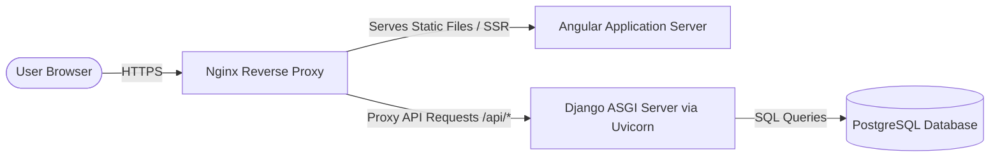

# Architecture & Development Workflow: Angular + Django

This document describes how to develop and deploy the Jewelry SaaS application using a **Modern Angular (v17+)** frontend and a **Django** backend.

---

## 1. High-Level Architecture



### Components:
- **Frontend**: Modern Angular (v17+) application. Served via Nginx as static files (or optionally Node/SSR for Angular Universal/SSR).
- **Backend**: Django (Python web framework) exposing a type-safe REST API using **Django REST Framework (DRF)** or **Django Ninja**. Served via Uvicorn (ASGI) in production.
- **Reverse Proxy**: Nginx handles SSL termination, static file routing, and redirects API requests to the backend.
- **Hosting Environment**: Hostinger VPS (KVM 2 plan running Ubuntu/Debian).

---

## 2. Local Development Workflow

To build and run the application locally, you will run the frontend and backend as two separate services communicating over localhost ports.

### Backend Setup (Django)

1. **Initialize Virtual Environment**:
   Navigate to the `backend` folder and create a virtual environment:
   ```bash
   cd backend
   python3 -m venv venv
   source venv/bin/activate
   ```

2. **Install Django & Extensions**:
   Install Django, DRF/Django Ninja, Uvicorn, and PostgreSQL adapter:
   ```bash
   pip install django django-cors-headers djangorestframework uvicorn psycopg2-binary
   pip freeze > requirements.txt
   ```

3. **Start Django Project**:
   ```bash
   django-admin startproject config .
   ```

4. **Configure CORS**:
   Add `corsheaders` to `INSTALLED_APPS` and middleware in `config/settings.py` to allow the frontend (`http://localhost:4200` by default for Angular) to make requests.
   ```python
   INSTALLED_APPS = [
       ...
       'corsheaders',
       'rest_framework',
   ]

   MIDDLEWARE = [
       'corsheaders.middleware.CorsMiddleware',
       ...
   ]

   CORS_ALLOWED_ORIGINS = [
       "http://localhost:4200",
   ]
   ```

5. **Start Dev Server**:
   ```bash
   python manage.py runserver 8000
   ```

### Frontend Setup (Angular)

1. **Install Angular CLI Globally (if needed)**:
   ```bash
   npm install -g @angular/cli
   ```

2. **Navigate and Install Dependencies**:
   ```bash
   cd frontend
   npm install
   ```

3. **Run Dev Server**:
   ```bash
   ng serve
   ```
   The dev server runs on `http://localhost:4200` by default.

4. **API Integration**:
   Configure Angular `HttpClient` or an API service to point to `http://localhost:8000/api/` (Django backend) via environment files (`src/environments/environment.ts`).

---

## 3. Communication Pattern (REST APIs)

- All frontend data fetching is managed using Angular's native `HttpClient` module.
- Forms are managed using Angular's **Reactive Forms** module (`ReactiveFormsModule`).
- Django will serve endpoints under `/api/...` (e.g., `/api/v1/jewelry/`).
- Use JSON schemas matching Angular model interfaces for request validation inside Django serializers (DRF) or Pydantic schemas (Django Ninja).

---

## 4. Production Deployment on Hostinger VPS (KVM 2)

On the Hostinger VPS, we will host both applications on the same server, routing requests based on path routing.

### Nginx Configuration
Nginx will be set up to listen on port 80/443:
- Route static assets and frontend pages directly from the built `dist/` directory of the Angular project.
- Proxy `/api/` and `/admin/` requests to the Uvicorn server running Django.

Example Nginx config snippet:
```nginx
server {
    listen 80;
    server_name yourdomain.com;

    # Frontend (Angular Static Bundle)
    location / {
        root /var/www/jewelry-saas/frontend/dist/browser;
        index index.html;
        try_files $uri $uri/ /index.html;
    }

    # Django Backend REST API
    location /api/ {
        proxy_pass http://127.0.0.1:8000; # Port where Uvicorn/Django runs
        proxy_set_header Host $host;
        proxy_set_header X-Real-IP $remote_addr;
        proxy_set_header X-Forwarded-For $proxy_add_x_forwarded_for;
        proxy_set_header X-Forwarded-Proto $scheme;
    }

    # Django Static/Media files
    location /django_static/ {
        alias /var/www/jewelry-saas/backend/static/;
    }
}
```

### Process Management
Use **systemd** or **PM2** to run the backend in the background and keep it running:
- **Uvicorn Daemon**:
  ```bash
  uvicorn config.asgi:application --host 127.0.0.1 --port 8000 --workers 4
  ```